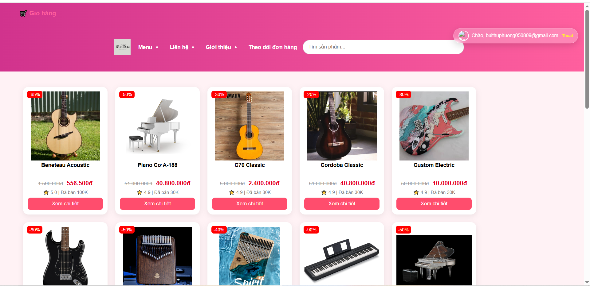
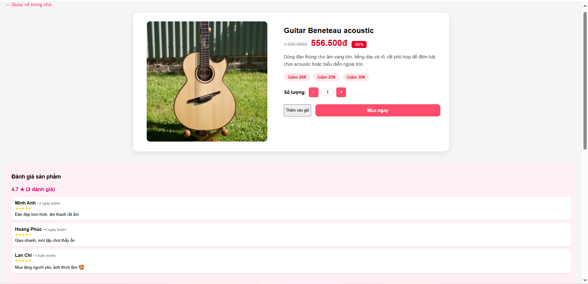
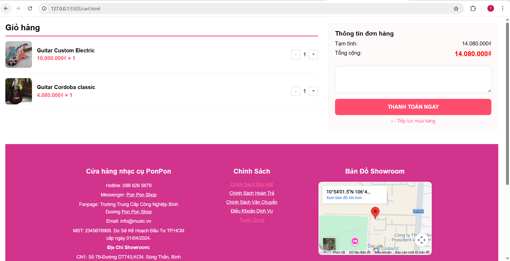
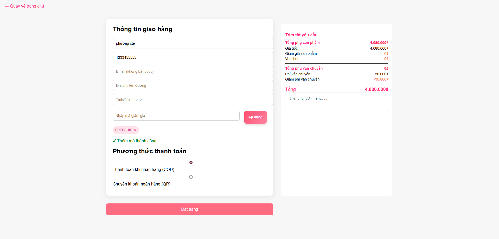
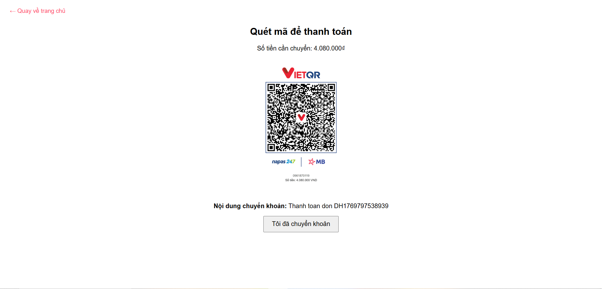
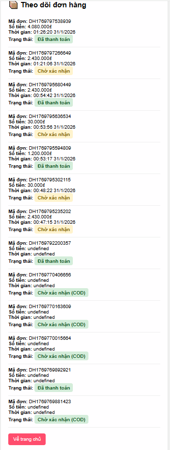

# 🛍️ PonPon Shop – Website Bán Hàng Online

PonPon Shop là website bán hàng online mô phỏng một cửa hàng thương mại điện tử.  
Người dùng có thể xem sản phẩm, thêm vào giỏ hàng, áp dụng mã giảm giá và thanh toán bằng nhiều hình thức.

---

## ✨ Chức năng chính

- 🏠 Trang chủ hiển thị danh sách sản phẩm  
- 🔍 Xem chi tiết sản phẩm  
- 🛒 Thêm vào giỏ hàng  
- 🔢 Tăng giảm số lượng sản phẩm  
- 🎟️ Áp dụng voucher giảm giá  
- 🚚 Tính phí vận chuyển  
- 💳 Thanh toán:
  - Thanh toán khi nhận hàng (COD)
  - Chuyển khoản bằng mã QR  
- 📦 Theo dõi trạng thái đơn hàng  

---

## 🧠 Công nghệ sử dụng

- **HTML** – Xây dựng cấu trúc website  
- **CSS** – Thiết kế giao diện  
- **JavaScript** – Xử lý chức năng như giỏ hàng, voucher, tính tổng tiền và lưu đơn hàng

---

## 🖼️ Hình ảnh website

### Trang chủ

### Trang chi tiết sản phẩm

### Giỏ hàng

### Trang thanh toán

### Trang quét mã QR

### Theo dõi đơn hàng

---

## 📂 Cách chạy project

1. Tải code về máy  
2. Mở file `index.html` bằng trình duyệt  
3. Trải nghiệm các chức năng của website  

---

## 🎯 Mục tiêu dự án

Dự án giúp rèn luyện kỹ năng thiết kế giao diện web và xử lý logic bằng JavaScript, mô phỏng quy trình mua hàng online.

---

## 👩‍💻 Tác giả

**Học sinh thực hiện:** 
* 24NT01038 - Bùi Thu Phương
* 24NT01037 - Từ Hoàng Oanh
* 24NT01027 - Lầu Nguyễn Phương Ngân 

**Môn học:** Thiết kế Web
**[Website ]**(https://bdi.edu.vn/)
**[link youtube sản phẩm]**(https://youtu.be/Uf6nqFmXk44)

